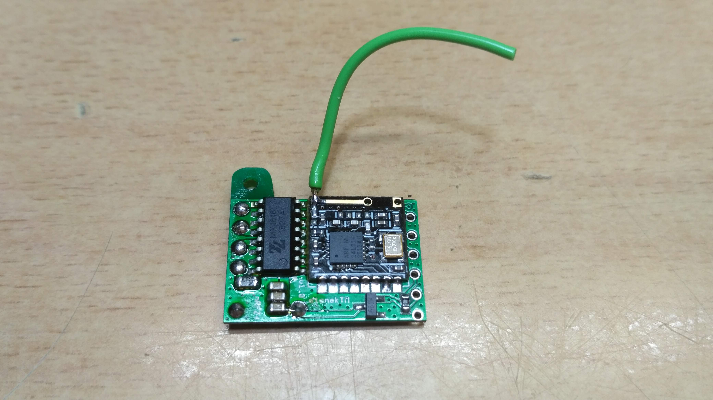
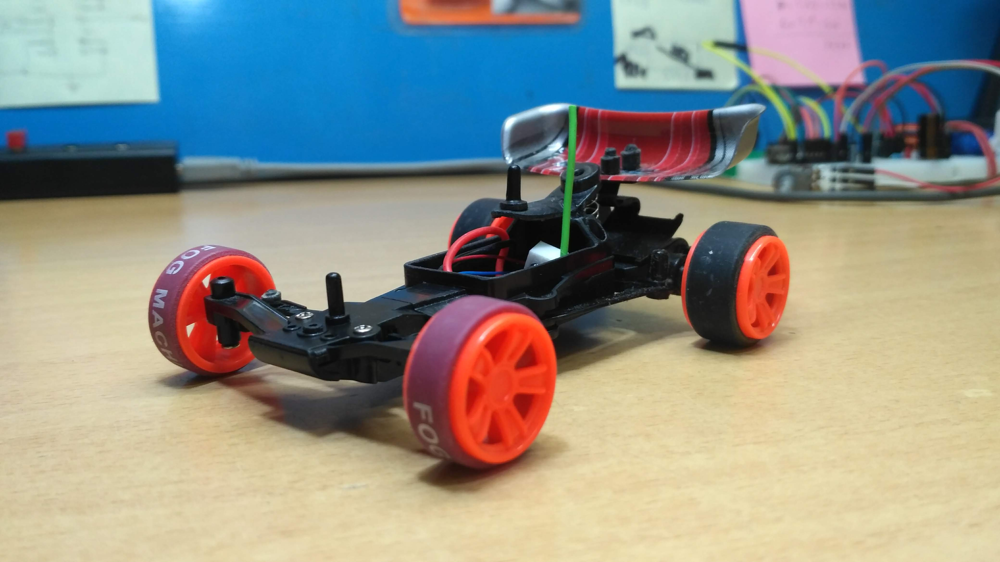
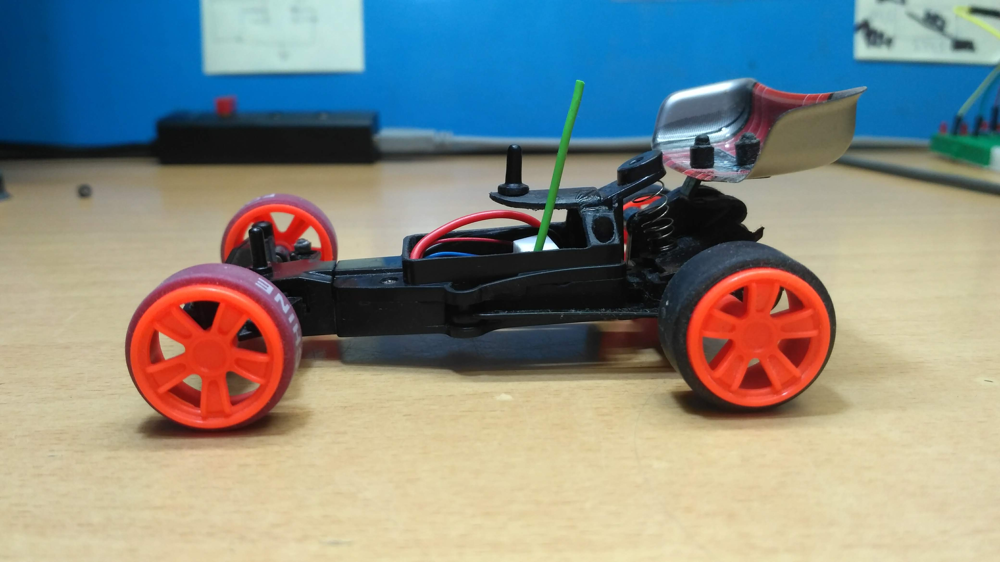

# RC receiver nRF24L01 Arduino
RC receiver nRF24L01 with ATmega328P 5V/16Mhz, Arduino Nano or Pro Mini.
Telemetry sends the monitored voltage RX to TX. 
The motor driver IC is based on MX1508, MX1208, MX1515, MX1616, TC1508S, SA8302 and others similar, using 4x pwm input control signals.
The possibility of setting the brake is in the code.
Other versions of the RX firmware include servo outputs.
The firmware will be used for cars, boats, tanks, robots and aircraft.

This RC receiver works with RC transmitters [RC_TX_nRF24L01_Telemetry_LCD](https://github.com/stanekTM/RC_TX_nRF24L01_Telemetry_LCD), 
[RC_TX_nRF24L01_Telemetry_LED](https://github.com/stanekTM/RC_TX_nRF24L01_Telemetry_LED), 
[OpenAVRc](https://github.com/stanekTM/OpenAVRc_Dev) or [DIY-Multiprotocol-TX-Module](https://github.com/stanekTM/DIY-Multiprotocol-TX-Module) from my fork.

Note: I use (Arduino) ATmega328P 5V/16Mhz and supply VCC only with 3.3V voltage. 
I haven't tried the 3.3V/8Mhz version yet. 
If you supply the VCC directly with a LiPo 1S cell, except for the nRF24L01, the analog voltage measurement will not work due to the VREF. 
All versions of the code are based on this [scheme](https://raw.githubusercontent.com/stanekTM/RC_RX_nRF24L01_Telemetry_Motor_Driver_Servo/master/documents/Schema_Micro_RX_2ch_A1_Motor_Driver.PNG), but each version uses different pins.
#
### Example micro RX:
Video here https://youtu.be/E0pgMNPuYU4

  

#
### RX prototype: 

#
### Used libraries:
* <RF24.h>                      https://github.com/nRF24/RF24 v1.3.9
* <DigitalIO.h>                 https://github.com/greiman/DigitalIO
* "PWMFrequency.h" used locally https://github.com/TheDIYGuy999/PWMFrequency
* <Servo.h>        Arduino standard library
#
Jiri StanekTM
